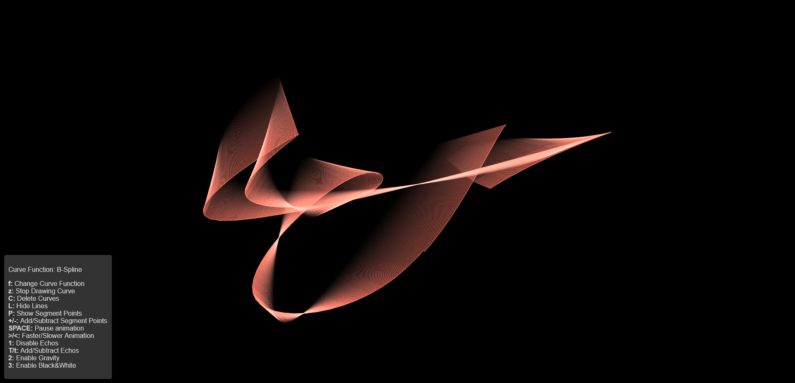
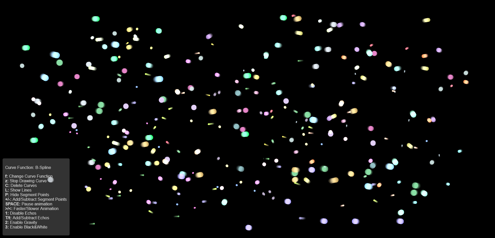

# WebGL Curve Visualisation

This project was developed for the **Computer Graphics and Interfaces** (CGI) course at NOVA FCT during the 2024/25 academic year.

The main objective was to implement a WebGL application that could generate and visualise cubic B-Spline, Catmull-Rom and Bézier curves.

## Animation

Each curve is animated to move and bump against the edges of the screen. Each curve is made up of several control points, each of which has a random velocity. Various **VFX** can be applied to a curve, such as echoes, black and white, and gravity.

## Screenshots

## Technologies used

- **WebGL 2.0**
- **JavaScript**
- **HTML / CSS**

## Author

Diogo Matias, @diogowa

